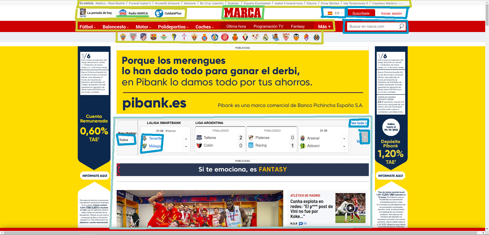
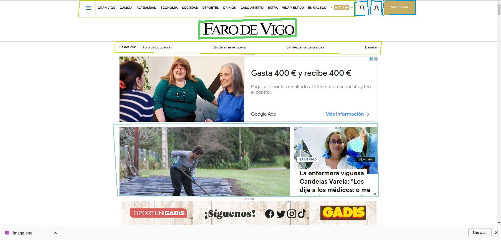
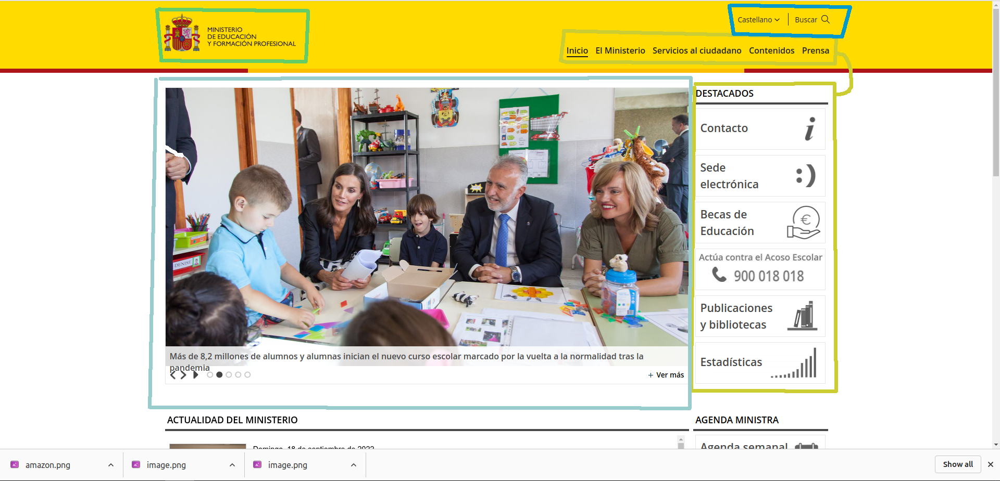

# Identificación de compoñentes
## Adan Jonathan Fariña Fernández
---
## Paleta de cores:
- 
<b>Identificación</b>

- 
<b>Navegación</b>

- 
<b>Contidos</b>

- 
<b>Interacción</b>

---
## [Marca](https://www.marca.com)

## [Faro de Vigo](https://www.farodevigo.es/)

## [Amazon](https://www.amazon.es)

## [Ministerio de Formación Profesional](https://www.educacionyfp.gob.es/portada.html)

